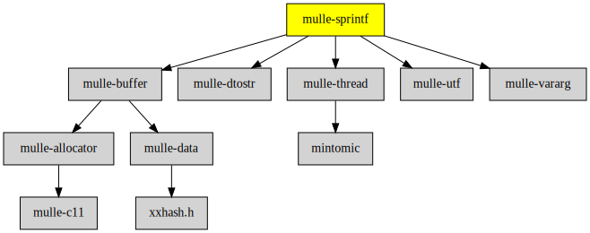

# mulle-sprintf

#### 🔢 An extensible sprintf function supporting stdarg and mulle-vararg

The extensibility is used in **MulleObjCStandardFoundation** to add the
'@' conversion character for object conversion.

mulle-sprintf can handle **varargs** and **mulle_vararg** style variable
arguments. Because floating point to string conversion is hard, floating point
conversions are handed down to `sprintf`. So it is not a sprintf replacement.

| Release Version                   |
|-----------------------------------|
| [](//github.com/mulle-core/mulle-sprintf/actions)   |

## Format characters

For more detailed information on each characte consult a
[sprintf man page](https://manpages.org/sprintf).


### Flag Characters

Character | Description
----------|---------------
<tt>&nbsp;</tt> (SPC) | A blank should be left before a positive number.
`0`       | The value should be zero padded.
`#`       | The value should be converted to an "alternate form".
`-`       | The converted value is to be left adjusted on the field boundary.
`+`       | A sign  (+  or -) should always be placed before a number.
`'`       | Use thousands' grouping characters (UNUSED)
`b`       | BOOL, print as YES or NO (for Objective-C)


### Length modifier

Characters | Description
-----------|---------------
`h`        | `short`
`hh`       | `char`
`j`        | `intmax_t`
`l`        | `long`
`ll`       | `long long`
`L`        | `long double` (FP only)
`q`        | `int64.`
`t`        | `ptrdiff_t`
`z`        | `size_t`


### Conversion Specifiers (built in)

#### Integer

Character | Description
----------|---------------
`i`       | `int` as decimal
`d`       | `int` as decimal
`D`       | `long int`                   (compatibility)
`u`       | `unsigned int`
`o`       | `int` as octal
`x`       | `int` as lowercase hex
`U`       | `unsigned long int`          (compatibility)
`O`       | `unsigned long int` as octal (compatibility)
`X`       | `unsigned long int` as hex   (compatibility)

Used modifiers: all except `L`

#### Floating Point (FP)

Uppercase conversion specifiers output value such as 0e-20 or nan as
uppercase 0E-20 or NAN.

Character | Description
----------|---------------
`a`       | double as hex [-]0xh.hhhhp+-d
`e`       | double as [-]d.ddde+-dd
`f`       | double as [-]ddd.ddd  with lowercase for inf/nan
`g`       | double in `e` or `f`
`A`       | double as hex [-]0Xh.hhhhP+-d
`E`       | double as [-]d.dddE+-dd
`F`       | double as [-]d.ddde+-dd with uppercase for INF/NAN
`G`       | double in `E` or `F`

Used modifiers: `L`.

The actual conversion is done with the C-library `sprintf` function. This is
contrast with the other conversions, which are not using the C library.


#### Pointer / String / Other

Character | Description
----------|---------------
`n`       | return conversion
`p`       | void * as hex with 0x prefix
`s`       | char * as utf8
`S`       | utf16 / utf32 with `l` modifier


Used modifiers: `l`


## Use

### Convenient

mulle-sprintf uses a dynamic loading scheme to add conversion routines. It is
important that the linker doesn't strip presumably "dead" code. This will happen
if you link mulle-sprintf as a static library without using --all_load or
some such. [Reference](//www.chrisgummer.com/llvm-load_all-and-force_load)


### Inconvenient

If you have or don't want to do it the convenient way, you need to add the
character conversion routines yourself. Add them before you call a
mulle-sprintf printing function:

``` c
struct mulle_sprintf_conversion   *conversion;

conversion = mulle_sprintf_get_defaultconversion();
mulle_sprintf_register_character_functions( conversion);
mulle_sprintf_register_decimal_functions( conversion);
mulle_sprintf_register_escape_functions( conversion);
mulle_sprintf_register_integer_functions( conversion);
mulle_sprintf_register_fp_functions( conversion);
mulle_sprintf_register_pointer_functions( conversion);
mulle_sprintf_register_return_functions( conversion);
mulle_sprintf_register_string_functions( conversion);

mulle_sprintf_register_standardmodifiers( conversion);
```


## Examples


## Just like sprintf


Here is an example that uses `mulle_sprintf` to print an integer into a
char array unsafely:


``` c
#include <mulle-sprintf/mulle-sprintf.h>
#include <stdio.h>


int   main( void)
{
   auto char   storage[ 32];

   mulle_sprintf( storage, "%d", 1848);
   printf( "%s\n", storage);

   return( 0);
}
```


## Using an explicit mulle-buffer

Here is an example that uses `mulle_buffer_sprintf` together with
[`mulle-buffer`](//github.com/mulle-c/mulle-buffer) to print two integers into
a char array safely. The printed result will be "1848":

``` c
#include <mulle-sprintf/mulle-sprintf.h>
#include <mulle-buffer/mulle-buffer.h>
#include <stdio.h>


int   main( void)
{
   struct mulle_buffer   buffer;

   mulle_buffer_init( &buffer, NULL);
   mulle_buffer_sprintf( &buffer, "%d", 18);
   mulle_buffer_sprintf( &buffer, "%d", 48);
   printf( "%*s\n", mulle_buffer_get_string( &buffer));
   mulle_buffer_done( &buffer);

   return( 0);
}
```

With the convenience macro `mulle_buffer_do` this reduces down to:


```c
int   main( void)
{
   mulle_buffer_do( buffer)
   {
      mulle_buffer_sprintf( buffer, "%d", 18);
      mulle_buffer_sprintf( buffer, "%d", 48);
      printf( "%*s\n", mulle_buffer_get_string( buffer));
   }

   return( 0);
}
```


## API

File                                  | Description
------------------------------------- | -------------------------------------
[`mulle_sprintf`](dox/API_SPRINTF.md) | The various sprintf like functions


### You are here




## Add

Use [mulle-sde](//github.com/mulle-sde) to add mulle-sprintf to your project:

``` sh
mulle-sde dependency add --marks all-load --c --github mulle-core mulle-sprintf
```


## Install

### mulle-sde

Use [mulle-sde](//github.com/mulle-sde) to build and install mulle-sprintf and all dependencies:

``` sh
mulle-sde install --prefix /usr/local \
   https://github.com/mulle-core/mulle-sprintf/archive/latest.tar.gz
```

### Manual Installation

Install the requirements:

Requirements                                               | Description
-----------------------------------------------------------|-----------------------
[mulle-thread](//github.com/mulle-concurrent/mulle-thread) | Threads and atomics
[mulle-buffer](//github.com/mulle-c/mulle-buffer)          | Growing character array
[mulle-utf](//github.com/mulle-c/mulle-utf)                | UTF functions
[mulle-vararg](//github.com/mulle-c/mulle-vararg)          | Variable arguments

Install into `/usr/local`:

``` sh
cmake -B build \
      -DCMAKE_INSTALL_PREFIX=/usr/local \
      -DCMAKE_PREFIX_PATH=/usr/local \
      -DCMAKE_BUILD_TYPE=Release &&
cmake --build build --config Release &&
cmake --install build --config Release
```

### Platforms and Compilers

All platforms and compilers supported by
[mulle-c11](//github.com/mulle-c/mulle-c11) and
[mulle-thread](//github.com/mulle-concurrent/mulle-thread).


## Author

[Nat!](//www.mulle-kybernetik.com/weblog) for
[Mulle kybernetiK](//www.mulle-kybernetik.com) and
[Codeon GmbH](//www.codeon.de)
